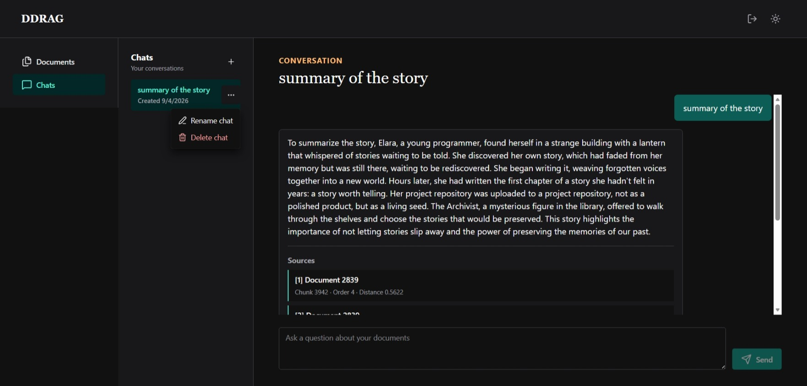
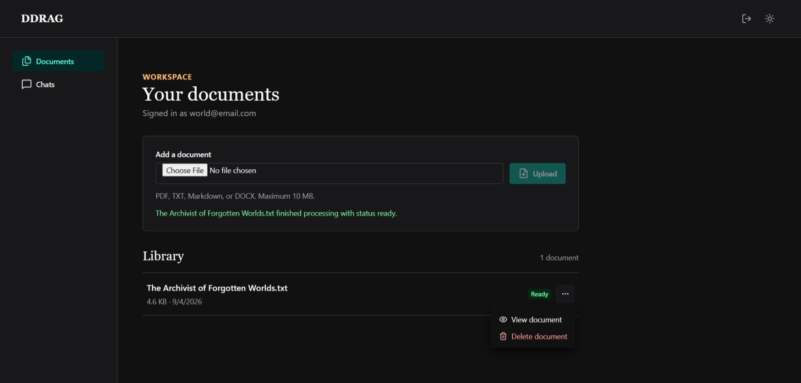
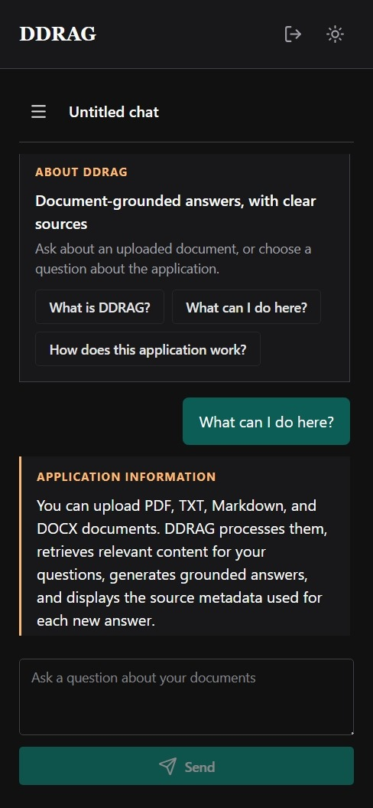

# DDRAG

**Drag, Drop, Retrieve, Augment, Generate**

DDRAG is a local-first retrieval-augmented generation (RAG) application for asking questions about your own documents. It accepts PDF, DOCX, Markdown, and text files, retrieves relevant passages with PostgreSQL and pgvector, and generates answers locally through Ollama with source attribution.

## Demo

🎥 **[Watch the DDRAG demo on YouTube](https://youtu.be/F0H7eqERpBA)**

The video demonstrates account creation, document ingestion, semantic retrieval, grounded answers with sources, and persistent chat history.

DDRAG runs locally with Docker, PostgreSQL + pgvector, and Ollama, keeping documents and model inference on the local machine.

### Interface preview

<p align="center">
  
</p>

*A grounded response with its retrieved source metadata and a persisted chat session.*

<p align="center">
  
</p>

*Document upload, processing feedback, and the authenticated user's document library.*

<p align="center">
  
</p>

*The chat workflow adapted for a narrow viewport.*

## Features

- JWT authentication with Argon2id password hashing and user-owned resources
- PDF, DOCX, Markdown, and TXT ingestion with file validation and duplicate detection
- deterministic, overlapping text chunks with versioned chunking metadata
- local embeddings and answer generation through Ollama
- owner-scoped cosine-distance retrieval with PostgreSQL + pgvector
- grounded prompts, source citations, and persistent chat history
- responsive React interface

## How It Works

```text
Upload document → Extract text → Create overlapping chunks → Generate embeddings
       → Store in PostgreSQL + pgvector → Retrieve relevant owned chunks
       → Build grounded context → Generate locally → Return answer + sources
```

The backend treats retrieved text as reference material and instructs the model to answer from the supplied context. When retrieval finds no relevant chunks, DDRAG returns an insufficient-information response without calling the generation model.

## Architecture

```text
Browser / React + Vite
          │ REST
          ▼
       FastAPI
          │
   ┌──────┼──────────────┐
   ▼      ▼              ▼
 Auth  Documents       Chats
          │              │
          ├── local document storage
          ├── PostgreSQL + pgvector
          └── Ollama (embeddings + generation)
```

FastAPI handles authentication, authorization, ingestion, retrieval, generation, and persistence. The React frontend consumes the backend API. See [docs/ARCHITECTURE.md](docs/ARCHITECTURE.md) for request flows, the data model, security boundaries, and detailed tradeoffs.

## Tech Stack

| Area | Technologies |
| --- | --- |
| Frontend | React, TypeScript, Vite, Chakra UI |
| Backend | Python 3.13, FastAPI, SQLAlchemy, Alembic |
| RAG | Ollama, vector embeddings, cosine-distance retrieval, grounded prompting |
| Data | PostgreSQL 16, pgvector, local document storage |
| Runtime | Docker, Docker Compose |
| Testing | pytest, dedicated PostgreSQL test database |

## Quick Start

Prerequisites: Git, Docker with Docker Compose, Ollama, and Node.js with npm. Python 3.13 is only required when running the backend outside Docker.

### Option 1 — Coding agent

Paste this into a repository-capable coding agent:

```text
Set up DDRAG from https://github.com/drZania/ddrag.git for local development.
Follow the repository's AGENTS.md for prerequisites, environment setup, Ollama models, Docker services, frontend setup, and verification.
Preserve any existing environment files, databases, and Docker volumes.
```

### Option 2 — Manual setup

Clone the repository:

```bash
git clone https://github.com/drZania/ddrag.git
cd ddrag
```

Create the backend environment file. Use `Copy-Item .env.example .env` in PowerShell or `cp .env.example .env` on Linux/macOS. Replace the checked-in `JWT_SECRET` placeholder in `.env` with a unique local value.

Pull the local models and start the database and backend:

```bash
ollama pull qwen3-embedding:0.6b
ollama pull qwen2.5:1.5b
docker compose up -d
```

In a second terminal, prepare and start the frontend:

```bash
cd frontend
npm ci
# PowerShell: Copy-Item .env.example .env
# Linux/macOS: cp .env.example .env
npm run dev
```

Open the Vite URL, normally `http://localhost:5173`. The backend applies Alembic migrations on startup and exposes `http://localhost:8000/health`.

See [docs/DEVELOPMENT.md](docs/DEVELOPMENT.md) for detailed Windows, Linux, and macOS setup, backend development, test database setup, reset behavior, and troubleshooting.

## Testing

Backend tests require `TEST_DATABASE_URL` to point to a dedicated PostgreSQL database whose name contains `test`. Never point it at the development database. See [Running Tests](docs/DEVELOPMENT.md#14-running-tests) before running `pytest`.

Frontend checks:

```bash
cd frontend
npm run lint
npm run typecheck
npm run build
```

## Design Highlights

- **PostgreSQL + pgvector** keeps relational ownership data, document chunks, and embeddings in one transactional data store.
- **Local inference through Ollama** keeps embedding and generation requests on the local machine.
- **Grounded source attribution** persists the retrieved chunks used for an answer so the interface can display backend-provided sources.
- **Backend-enforced ownership** derives resource access from the authenticated user and scopes document, retrieval, and chat queries server-side.

See [Key Design Decisions](docs/ARCHITECTURE.md#21-key-design-decisions) for detailed tradeoffs and architecture discussion.

## Project Structure

```text
app/                    FastAPI application and RAG pipeline
frontend/src/           React interface and API client
migrations/             Alembic schema history
tests/                  Backend tests and database safety setup
docs/ARCHITECTURE.md    System design and request flows
docs/DEVELOPMENT.md     Detailed local development guide
```

## License

MIT License. See [LICENSE](LICENSE).
